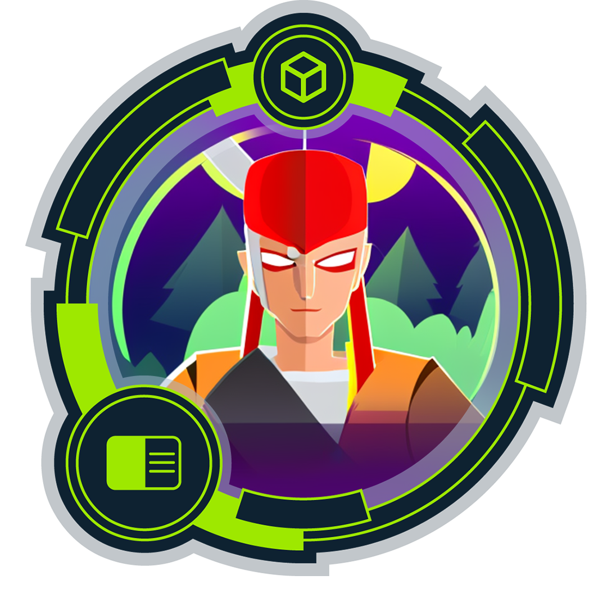
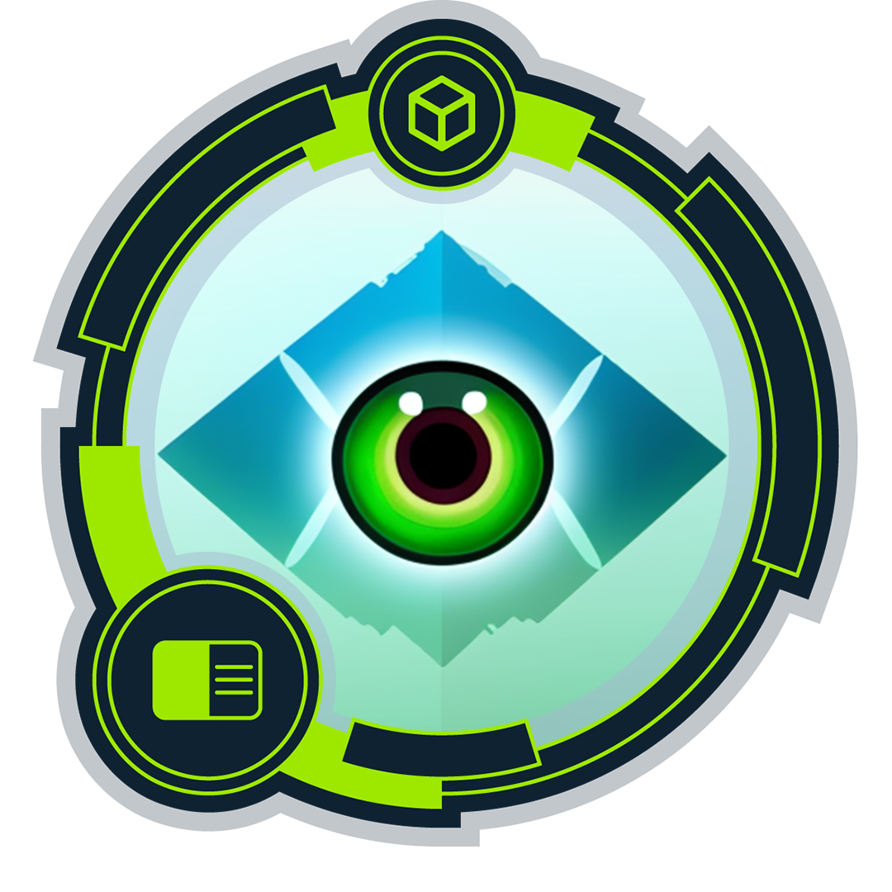
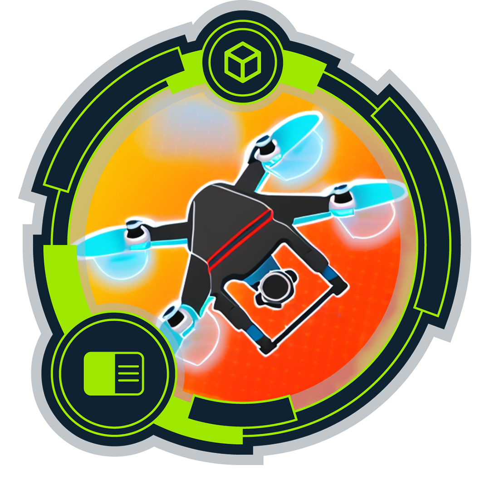
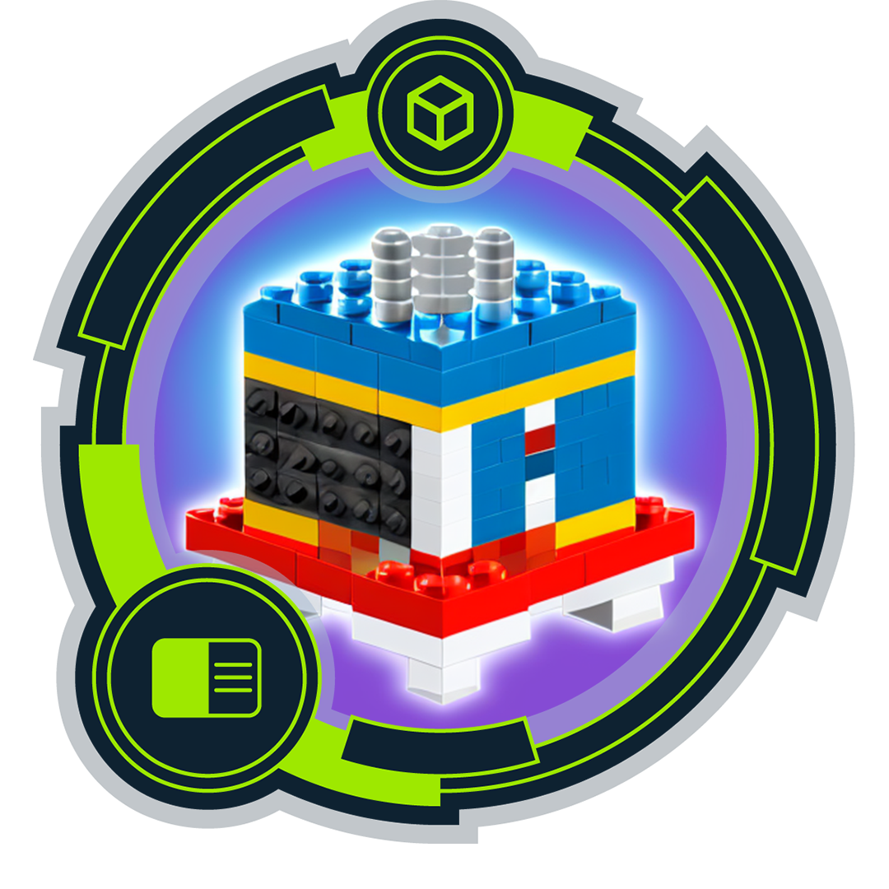
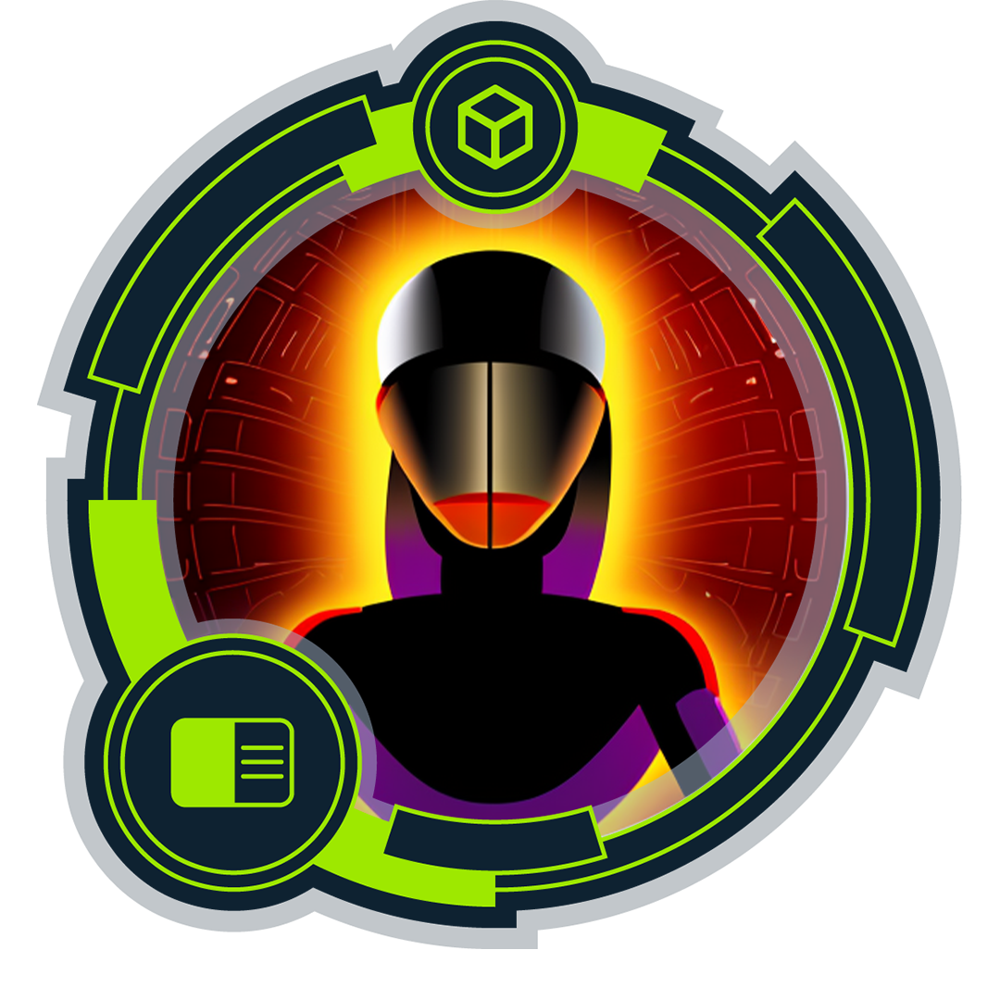
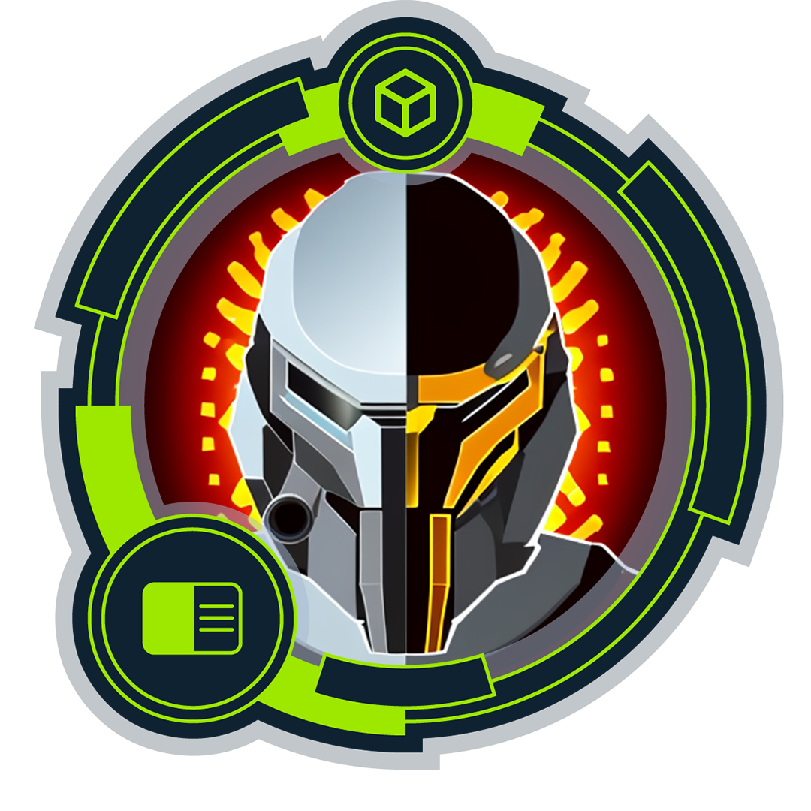

  
  # ⚡ Hi there, I'm Hassan Ali (FallenGodfather) aka Leandros
  ### 🛡️ Cybersecurity Penetration Tester | 🎓 BTU Cottbus Student | 🎯 CPTS Candidate
  
  

    
    
  

  
  *“Break things ethically, fix them responsibly.”*
  
   

  
  
  
  

---

## 🕵️‍♂️ About Me

I am a Cybersecurity Penetration Tester focused on ethical hacking, network exploitation, and vulnerability assessment. I enjoy hands-on offensive security work across web, network, and Linux/Windows environments. My goal is to turn reconnaissance into clear attack paths and translate those findings into actionable remediation advice.

- 🌍 **Based in:** Cottbus, Brandenburg, DE
- 📚 **Studying:** Cybersecurity at BTU Cottbus (Germany)
- 🎯 **Current Certification Goal:** CPTS (Certified Penetration Testing Specialist)
- 🛠️ **Building:** Pentesting tooling + documenting practical learning

---

## 🚀 Current Focus & Skills

  
<b>🔥 Offensive Security & Workflow (Click to expand)</b>

   
  <ul>
    <li><b>End-to-End Pentesting:</b> Scoping → Reconnaissance → Exploitation → PrivEsc → Reporting</li>
    <li><b>Web App Security:</b> Auth bypass, Access Control, SQLi/NoSQLi, SSRF, File Handling, Deserialization</li>
    <li><b>Infrastructure:</b> AD fundamentals, Windows/Linux Privilege Escalation (Lab-based)</li>
  </ul>

  
<b>💻 Scripting & Automation (Click to expand)</b>

   
  <ul>
    <li>Writing clean, reusable automation in <b>Python</b> and <b>Bash</b></li>
    <li>Developing pentest helper scripts (enumeration, parsing, report notes automation)</li>
    <li>Building small security tools (HTTP testing, subdomain checks, wordlist helpers)</li>
  </ul>

---

## 🏆 Hack The Box & Certifications

**Certifications:**
- ⏳ **CPTS (HTB)** — *In progress*

**Hack The Box Stats:**
- 🕹️ **Activity:** Actively completing Active Machines, ProLabs, Challenges & Fortress
- 🛤️ **Track:** HTB Academy Penetration Tester Job Path

  
<b>🛡️ View HTB Academy Badges (Click to expand)</b>

   
  
  > *Click on the badges to verify and see more details.*
  
  <table>
    <tr>
      <td align="center">
        
        
<strong>Your First Battle</strong>

        
Getting Started module completed

      </td>
      <td align="center">
        
        
<strong>The eye that sees all</strong>

        
Network Enumeration with Nmap module completed

      </td>
      <td align="center">
        
        
<strong>Airborne delivery</strong>

        
File Transfers module completed

      </td>
      <td align="center">
        
        
<strong>Combine the Modules</strong>

        
Using the Metasploit Framework module completed

      </td>
      <td align="center">
        
        
<strong>Ghost in the shell</strong>

        
Shells & Payloads module completed

      </td>
    </tr>
    <tr>
      <td align="center">
        
        
<strong>Information is not knowledge, or is it?</strong>

        
For completing the Information Gathering - Web Edition module

      </td>
      <td align="center">
        
        
<strong>Grab the keys and move laterally</strong>

        
Password Attacks module completed

      </td>
      <td align="center">
        
        
<strong>Light in the Dark</strong>

        
Vulnerability Assessment module completed

      </td>
      <td align="center">
        
        
<strong>Tactical</strong>

        
Penetration Testing Process module completed

      </td>
      <td align="center">
        
        
<strong>You need to trace before you can hunt</strong>

        
Footprinting module completed

      </td>
    </tr>
    <tr>
      <td align="center">
        
        
<strong>Academician</strong>

        
Introduction to Academy module completed

      </td>
    </tr>
  </table>

---

## 📊 GitHub Analytics

  

---

## 📜 Write-ups & Projects Policy

I am actively building out lab notes, sanitized learning resources, and open-source tooling. 

> **Note on HTB:** I do not publish solutions or spoilers for Hack The Box *Active Machines*. For retired content, I share high-level learning notes and sanitized write-ups focused purely on techniques and methodology. Expect full write-ups on my website soon!

---

## 🎯 2026 Objectives
- [ ] Earn the **CPTS** certification.
- [ ] Earn the **CAPS** certification.
- [ ] Earn the **CWES** certification.
- [ ] Deepen knowledge in Advanced Web & Active Directory pentesting.
- [ ] Ship polished open-source tooling and offensive security documentation.
- [ ] Build a strong portfolio highlighting clear methodology and measurable progress.

   
  

