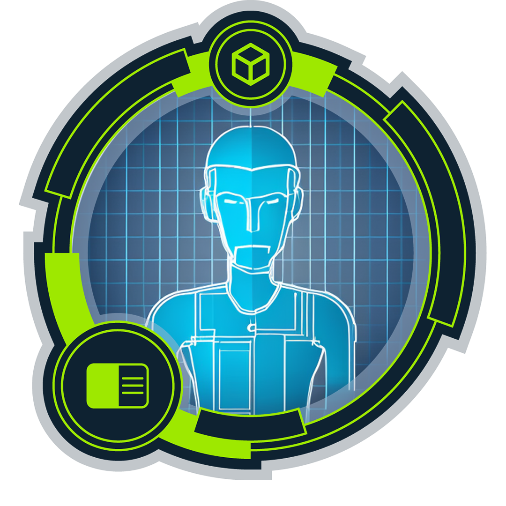
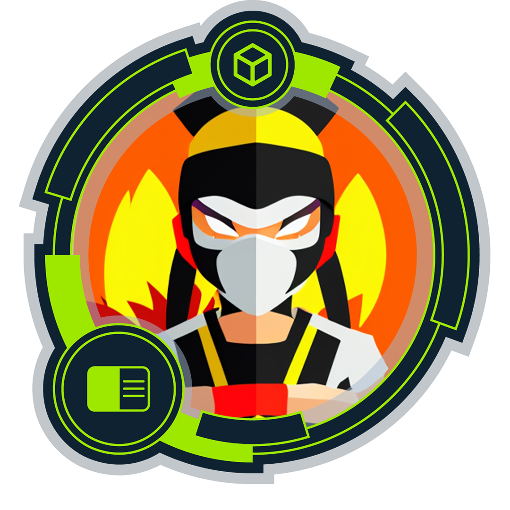
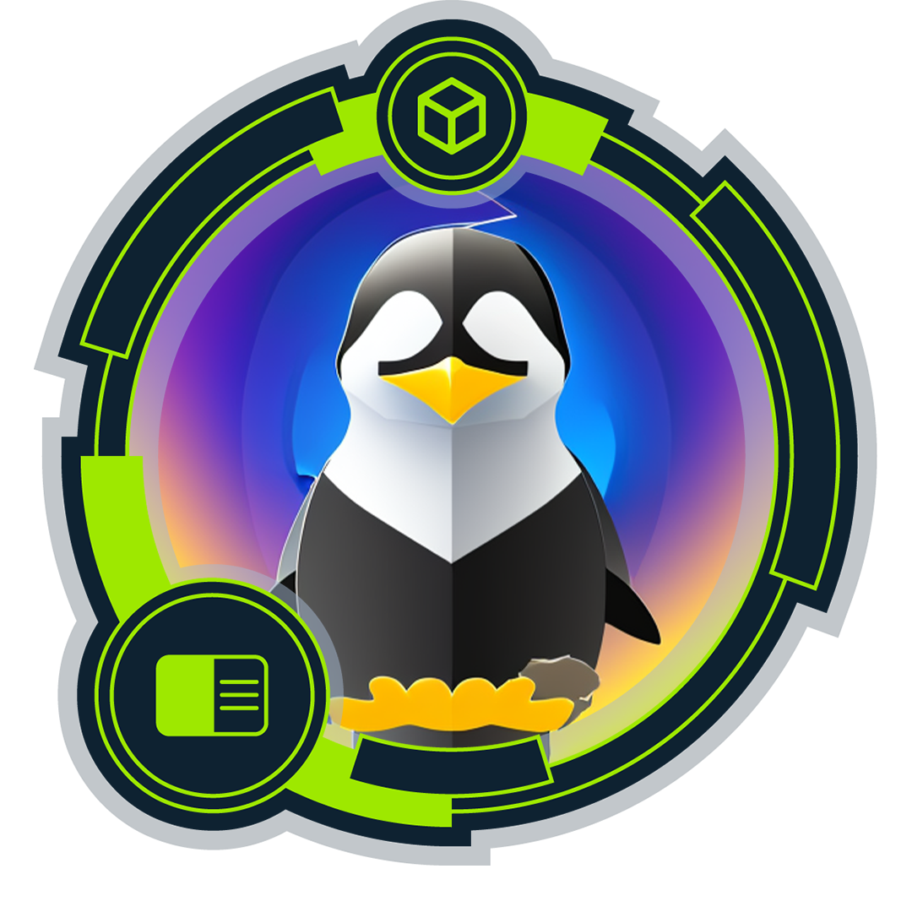
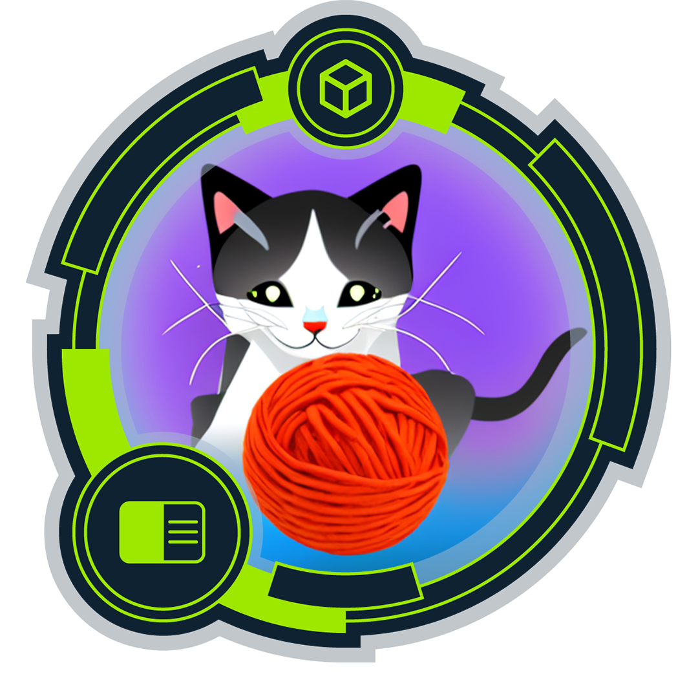
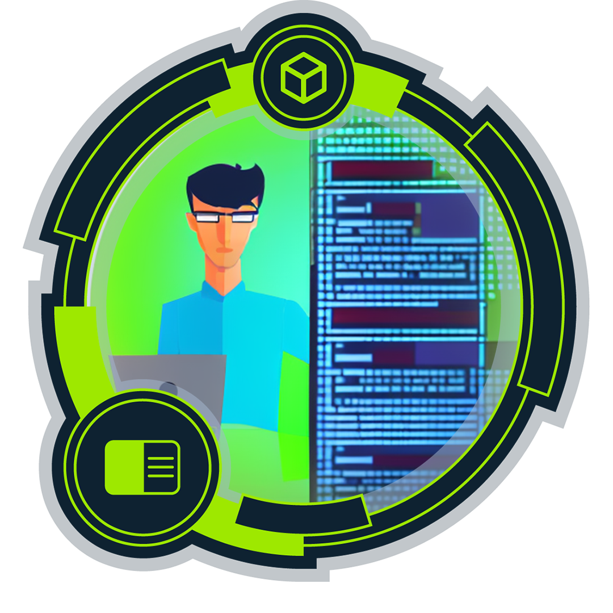
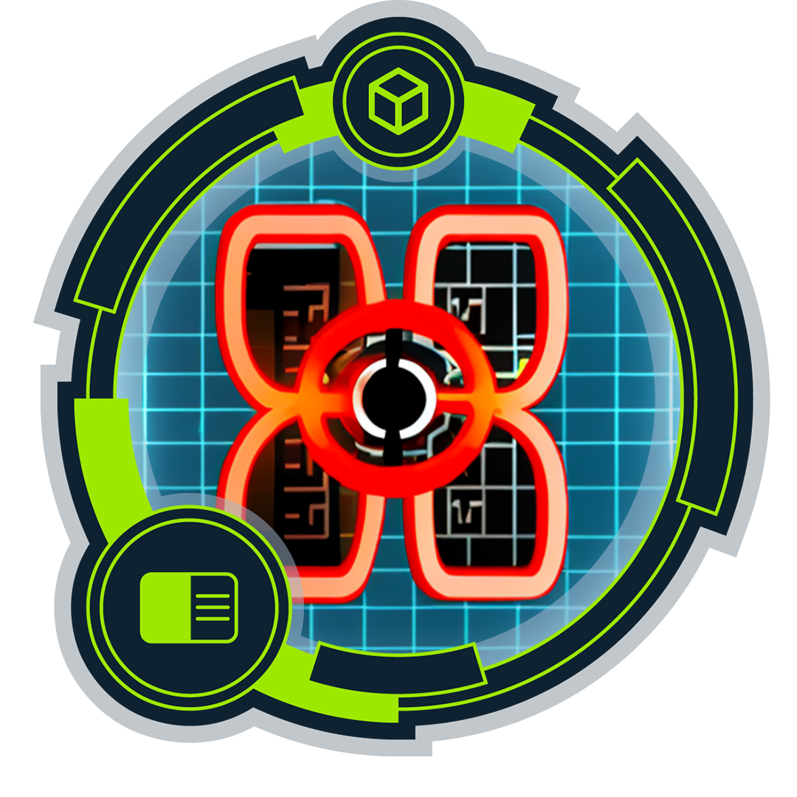
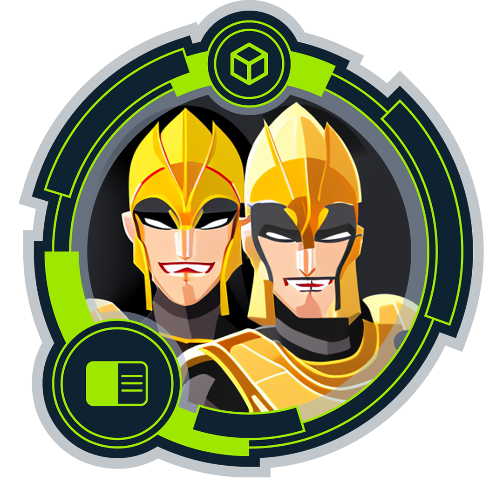

# Hi there I'm Hassan Ali (FallenGodfather) aka Leandros

## About Me

Cybersecurity Penetration Tester focused on ethical hacking, network exploitation, and vulnerability assessment.  
Studying Cybersecurity at BTU Cottbus (Germany), preparing for CPTS, and actively completing Hack The Box active machines.

## Quick highlights
- Cybersecurity student at **BTU Cottbus (Germany)**
- Preparing for **CPTS (Certified Penetration Testing Specialist)**
- Active on **Hack The Box** (Active Machines) — **Pro Hacker rank** on HTB Labs
- Building pentesting tooling + documenting practical learning

## What I do
I enjoy hands-on offensive security work across web, network, and Linux/Windows environments. I like turning reconnaissance into clear attack paths, then translating findings into actionable remediation advice.

## Current focus
- Strengthening end-to-end pentest workflow: scoping → recon → exploitation → privesc → reporting
- Web app security testing (auth, access control, injection, SSRF, file handling, deserialization)
- AD fundamentals and Windows privilege escalation (lab-based)
- Writing clean, reusable automation in Python and Bash

## Skills & tooling
**Core areas**
- Network enumeration & exploitation
- Web application penetration testing
- Linux & Windows privilege escalation
- Scripting for automation and repeatable workflows

**Achievements**
_**Badges (Click on the badges to verify and see more details):**_   
<table>
  <tr>
<td align="center">

      
<strong>Crawl, walk, run</strong>

      
For completing the Windows Fundamentals module

</td>
<td align="center">

      
<strong>Dive into requests</strong>

      
For completing the Using Web Proxies module

</td>
<td align="center">

      
<strong>Everything is connected</strong>

      
For completing the Introduction to Networking module

</td>
    <td align="center">

      
<strong>First things first</strong>

      
For completing the Operating System Fundamentals path

</td>
    <td align="center">

      
<strong>Fuzzing is power</strong>

      
For completing the Attacking Web Applications with Ffuf module

</td>
  </tr>
  <tr>
<td align="center">

      
<strong>Information is not knowledge, or is it?</strong>

      
For completing the Information Gathering - Web Edition module

</td>
<td align="center">

      
<strong>Our favorite seabird</strong>

      
For completing the Linux Fundamentals module

</td>
<td align="center">

      
<strong>Philomath</strong>

      
For completing the Learning Process module

</td>
    <td align="center">

      
<strong>Playing with the mess</strong>

      
For completing the JavaScript Deobfuscation module

</td>
    <td align="center">

      
<strong>Your request is my demand</strong>

      
For completing the Web Requests module

</td>
  </tr>
    <tr>
<td align="center">

      
<strong>Developer</strong>

      
For completing the Introduction to Web Applications module

</td>
      <td align="center">

      
<strong>Included in every report</strong>

      
For completing the Cross-Site Scripting (XSS) module

</td>
            <td align="center">

      
<strong>DROP your weapon</strong>

      
For completing the SQL Injection Fundamentals module

</td>
  </tr>
</table>

## Certifications
- CPTS (HTB) — In progress

## Hack The Box
- Rank: Pro Hacker (HTB Labs)
- Actively completing: Active Machines
- Learning track: HTB Academy Penetration Tester Job Path

## Links
- HTB Profile: https://app.hackthebox.com/public/users/248307
- My Website: https://h4cker-hub.tech 

## Projects
A few things you’ll find here (or that I’m actively building):
- Pentest helper scripts (enumeration, parsing, report notes automation)
- Small security tools in Python (HTTP testing, subdomain checks, wordlist helpers)
- Lab notes and learning resources (sanitized, no active-machine spoilers)

## Write-ups policy
I have plans to post writeups on my website soon, I don’t publish solutions for HTB Active Machines. For retired content, I may share high-level learning notes or sanitized write-ups focused on techniques, not spoilers.

## Goals for 2026
- Earn CPTS
- Keep improving web + AD pentesting depth
- Ship more polished open-source tooling and documentation
- Build a strong portfolio with clear methodology and measurable progress

## Connect
- LinkedIn: https://www.linkedin.com/in/HassanAliJadavjee  
- Email: hassanalijadavjee.work@gmail.com
- Location: Cottbus, Brandenburg, DE

---
“Break things ethically, fix them responsibly.”
