<div align="center">
  
  <br>

  <!-- ⚡ ANIMATED TERMINAL HEADER -->
  <p align="center">
    <a href="https://github.com/FallenGodfather">
      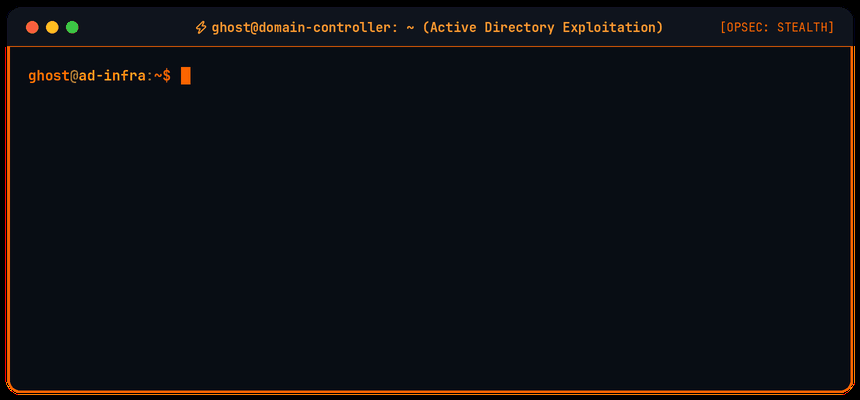
    </a>
  </p>

  <!-- 🛡️ INTERACTIVE ORANGE & BLACK BADGES -->
  <p align="center">
    <a href="https://github.com/FallenGodfather">
      
    </a>
    <a href="https://github.com/FallenGodfather?tab=followers">
      
    </a>
    <a href="https://app.hackthebox.com/public/users/248307">
      
    </a>
    <a href="https://h4cker-hub.tech">
      
    </a>
    <a href="https://www.linkedin.com/in/hassan-ali-jadavjee/">
      
    </a>
    <a href="mailto:hassanalijadavjee.work@gmail.com">
      
    </a>
  </p>

  <p align="center">
    <em>“Unseen on the wire. Lethal in Active Directory forests. Meticulous in remediation.”</em>
  </p>

</div>

---

## 🕵️‍♂️ Operator Dossier

I am an offensive security **Penetration Tester** holding an **MSc in Cybersecurity**, specializing in **Active Directory Pentesting**, enterprise identity compromise, and internal network exploitation.

I operate with a **talented ghost methodology**: prioritizing silent footholds, living off the land (LOLBins), and abusing legitimate domain trusts and access control lists (ACLs) rather than triggering noisy payloads. My mission is to identify the non-obvious attack paths that compromise entire Active Directory forests—and translate those findings into actionable, enterprise-grade remediation advice for defenders and C-level stakeholders.

```yaml
[OPERATOR PROFILE]
├── Identity       : Leandros (FallenGodfather)
├── Role           : Penetration Tester
├── Credentials    : MSc in Cybersecurity
├── Specialization : Active Directory Infiltration & Enterprise Red Teaming
├── Tradecraft     : Kerberos Abuse, ADCS Escalation, BloodHound Graph Mining, LOLBins
├── Philosophy     : "If the blue team knows we are there, the assessment has barely started."
└── Operational St.: [ STEALTH ACTIVE // LIVING OFF THE LAND ]
```

---

## 📡 Active Directory Operational Radar & HUD

<div align="center">
  <p align="center">
    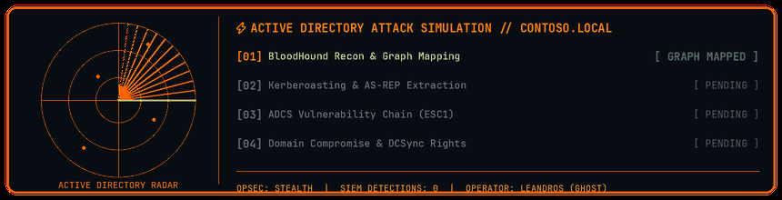
  </p>
</div>

---

## ⚔️ Offensive Capabilities & Attack Vectors

<details open>
  <summary><b>🌲 Active Directory Exploitation & Domain Dominance (Click to collapse)</b></summary>
  <br>
  <ul>
    <li><b>Identity & Kerberos Infiltration:</b> Kerberoasting, AS-REP Roasting, Unconstrained / Constrained / Resource-Based Constrained Delegation (RBCD) abuse.</li>
    <li><b>ADCS Vulnerability Chains:</b> Practical exploitation of Active Directory Certificate Services misconfigurations (ESC1 through ESC8) for certificate-based persistence and Domain Admin impersonation.</li>
    <li><b>Graph-Based Path Discovery:</b> In-depth BloodHound Cypher analysis, DACL/SACL abuse, GenericAll/WriteDacl escalation, and GPO hijacking.</li>
    <li><b>Forest Compromise & Persistence:</b> Cross-forest trust exploitation, Golden / Silver Ticket generation, Shadow Credentials (msDS-KeyCredentialLink), and DCSync replication (<code>secretsdump</code>).</li>
  </ul>
</details>

<details>
  <summary><b>🌐 Offensive Web Application Security (Click to expand)</b></summary>
  <br>
  <ul>
    <li><b>Access Control & Auth Flaws:</b> Complex authorization bypasses, SSO / SAML / OAuth token tampering, and privilege escalation.</li>
    <li><b>Server-Side Exploitation:</b> SSRF pivoting into internal metadata & Active Directory endpoints, SQLi / NoSQLi, File Handling, and Insecure Deserialization.</li>
    <li><b>Modern Web Vectors:</b> Prototype Pollution, race conditions, JWT exploitation, and API security auditing.</li>
  </ul>
</details>

<details>
  <summary><b>🥷 Stealth, Evasion & Post-Exploitation (Click to expand)</b></summary>
  <br>
  <ul>
    <li><b>Living Off the Land (LOLBins):</b> Native Windows/Linux binary weaponization to bypass application whitelisting without writing suspicious artifacts to disk.</li>
    <li><b>Credential Harvesting:</b> LSASS dumping techniques, DPAPI vault extraction, SAM/SYSTEM hives, and token manipulation.</li>
    <li><b>OPSEC & Defense Evasion:</b> In-memory execution, event log hygiene, and AMSI / ETW bypass tradecraft in lab environments.</li>
  </ul>
</details>

<details>
  <summary><b>⚙️ Scripting, Weaponization & Tooling (Click to expand)</b></summary>
  <br>
  <ul>
    <li>Developing custom offensive tooling and recon automation in <b>Python</b> and <b>Bash</b>.</li>
    <li>Automating Active Directory enumeration pipelines, BloodHound data ingestion, and Kerberos ticket manipulation.</li>
    <li>Writing automated report parsers and note-taking helpers for structured, reproducible client deliverables.</li>
  </ul>
</details>

---

## 🛠️ The Ghost's Arsenal & Technologies

<div align="center">
  <p><b>Offensive Tradecraft & Core Infrastructure:</b></p>
  <a href="https://github.com/FallenGodfather">
    
  </a>
  <br><br>

  <!-- Interactive specialized tool badges in Orange & Black -->
  <a href="https://github.com/BloodHoundAD/BloodHound">
    
  </a>
  <a href="https://github.com/fortra/impacket">
    
  </a>
  <a href="https://github.com/gentilkiwi/mimikatz">
    
  </a>
  <a href="https://github.com/ly4k/Certipy">
    
  </a>
  <a href="https://portswigger.net/burp">
    
  </a>
  <a href="https://nmap.org/">
    
  </a>
  <a href="https://www.metasploit.com/">
    
  </a>
  <a href="https://www.wireshark.org/">
    
  </a>
</div>

---

## 🏆 Hack The Box & Certifications Room

**Target Certifications & Offensive Track:**

<table>
  <tr>
    <td align="center">
      <a href="https://app.hackthebox.com/public/users/248307">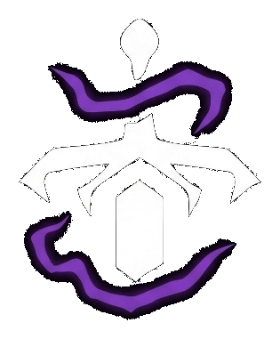</a>
      <p><strong>CPTS</strong></p>
      <p>Certified Penetration Testing Specialist</p>
      <p><i>On-going</i></p>
    </td>
    <td align="center">
      <a href="https://app.hackthebox.com/public/users/248307"></a>
      <p><strong>CAPE</strong></p>
      <p>Certified Active Directory Pentesting Expert</p>
      <p><i>On-going</i></p>
    </td>
    <td align="center">
      <a href="https://app.hackthebox.com/public/users/248307">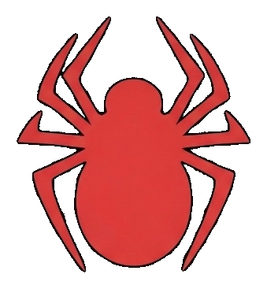</a>
      <p><strong>CWES</strong></p>
      <p>Certified Web Exploitation Specialist</p>
      <p><i>On-going</i></p>
    </td>
    <td align="center">
      <a href="https://app.hackthebox.com/public/users/248307">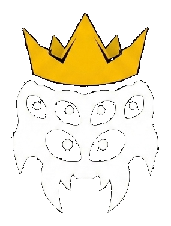</a>
      <p><strong>CWEE</strong></p>
      <p>Certified Web Exploitation Expert</p>
      <p><i>On-going</i></p>
    </td>
  </tr>
  <tr>
    <td align="center">
      <a href="https://app.hackthebox.com/public/users/248307">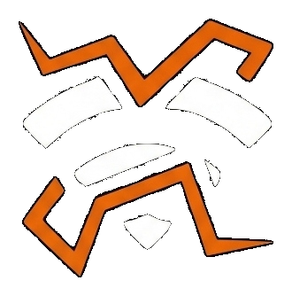</a>
      <p><strong>CWPS</strong></p>
      <p>Certified Wifi Pentesting Specialist</p>
      <p><i>On-going</i></p>
    </td>
    <td align="center">
      <a href="https://app.hackthebox.com/public/users/248307">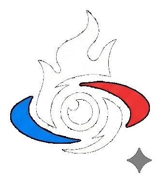</a>
      <p><strong>CJCA</strong></p>
      <p>Certified Junior Cybersecurity Associate</p>
      <p><i>On-going</i></p>
    </td>
    <td align="center">
      <a href="https://app.hackthebox.com/public/users/248307">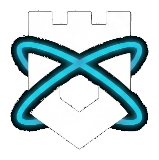</a>
      <p><strong>CDSA</strong></p>
      <p>Certified Defensive Security Analyst</p>
      <p><i>On-going</i></p>
    </td>
    <td align="center">
      <a href="https://app.hackthebox.com/public/users/248307">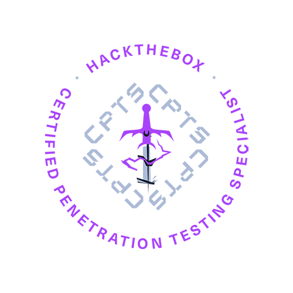</a>
      <p><strong>HTB PT Path</strong></p>
      <p>Academy Penetration Tester Job Path</p>
      <p><i>Active</i></p>
    </td>
  </tr>
</table>

**Offensive Lab Stats:**
- 🕹️ **Activity:** Actively conquering Active Machines, ProLabs, AD Forests & Endgames
- 🛤️ **Curriculum:** HTB Academy Penetration Tester & Active Directory Specialist Tracks

<details>
  <summary><b>🛡️ View HTB Academy Badges Trophy Room (Click to expand)</b></summary>
  <br>
  
  > *Click on badges to explore module achievements and practical skills verified.*
  
  <table>
    <tr>
      <td align="center">
        <a></a>
        <p><strong>Your First Battle</strong></p>
        <p>Getting Started Module</p>
      </td>
      <td align="center">
        <a>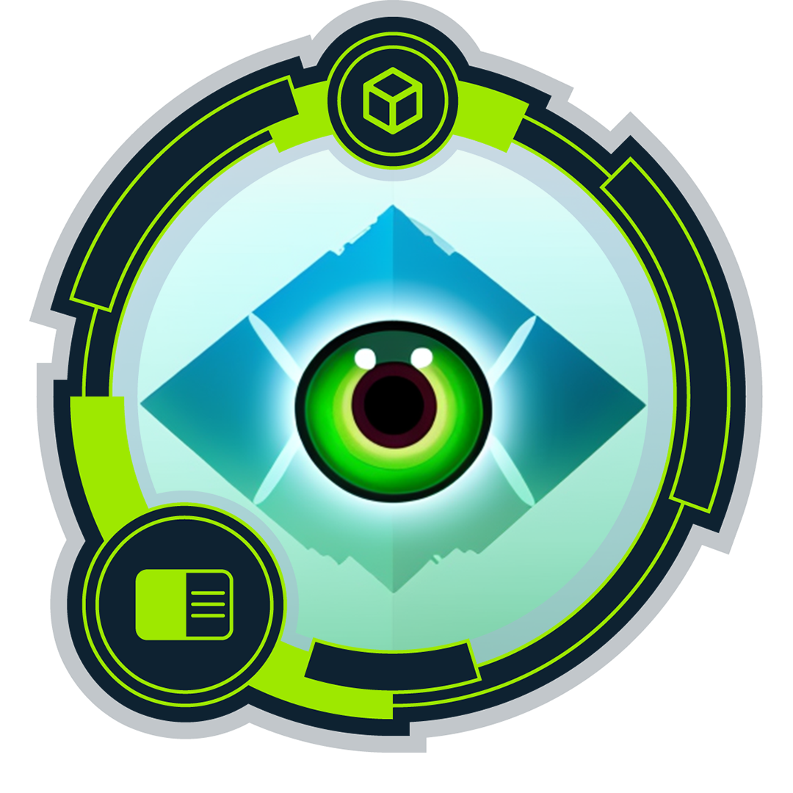</a>
        <p><strong>The Eye That Sees All</strong></p>
        <p>Network Enumeration with Nmap</p>
      </td>
      <td align="center">
        <a>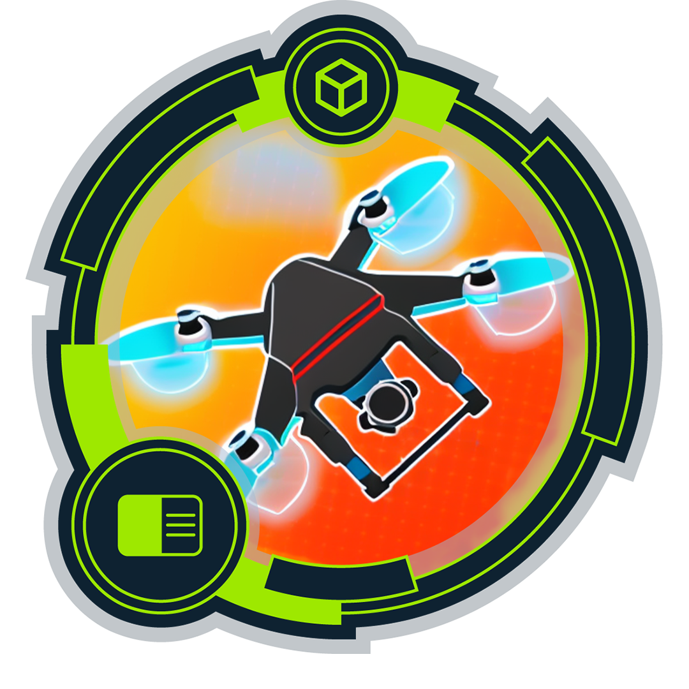</a>
        <p><strong>Airborne Delivery</strong></p>
        <p>File Transfers Module</p>
      </td>
      <td align="center">
        <a>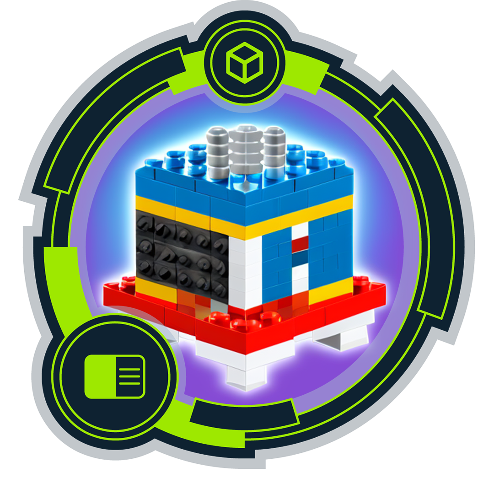</a>
        <p><strong>Combine the Modules</strong></p>
        <p>Metasploit Framework</p>
      </td>
      <td align="center">
        <a></a>
        <p><strong>Ghost in the Shell</strong></p>
        <p>Shells & Payloads Module</p>
      </td>
    </tr>
    <tr>
      <td align="center">
        <a>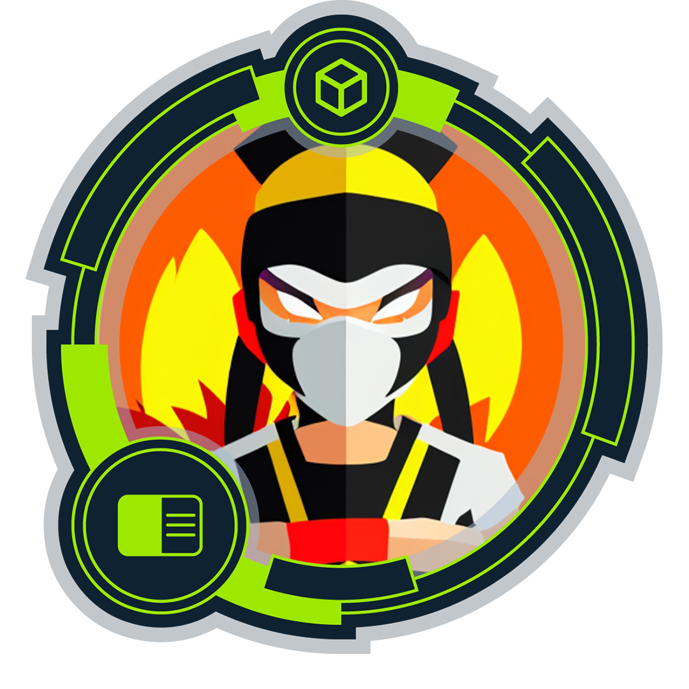</a>
        <p><strong>Information Gathering</strong></p>
        <p>Web Edition Recon</p>
      </td>
      <td align="center">
        <a></a>
        <p><strong>Move Laterally</strong></p>
        <p>Password Attacks Module</p>
      </td>
      <td align="center">
        <a>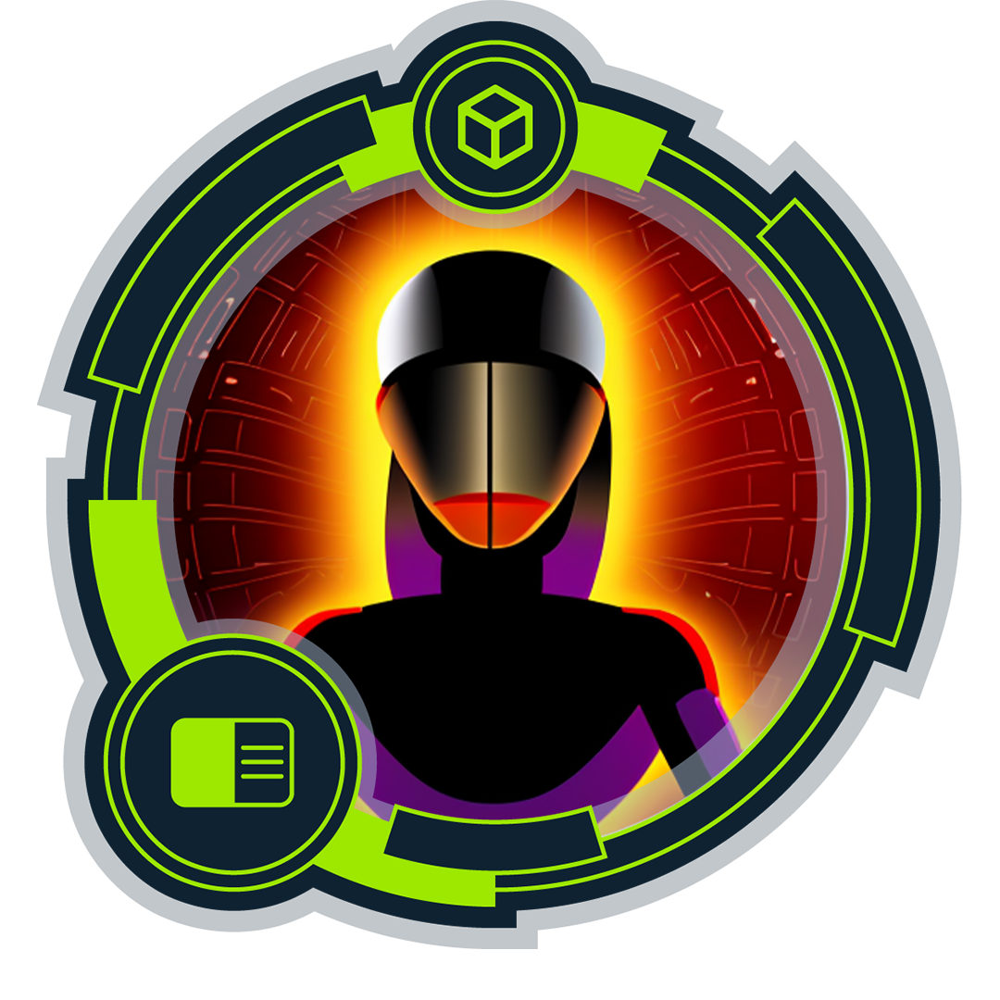</a>
        <p><strong>Light in the Dark</strong></p>
        <p>Vulnerability Assessment</p>
      </td>
      <td align="center">
        <a>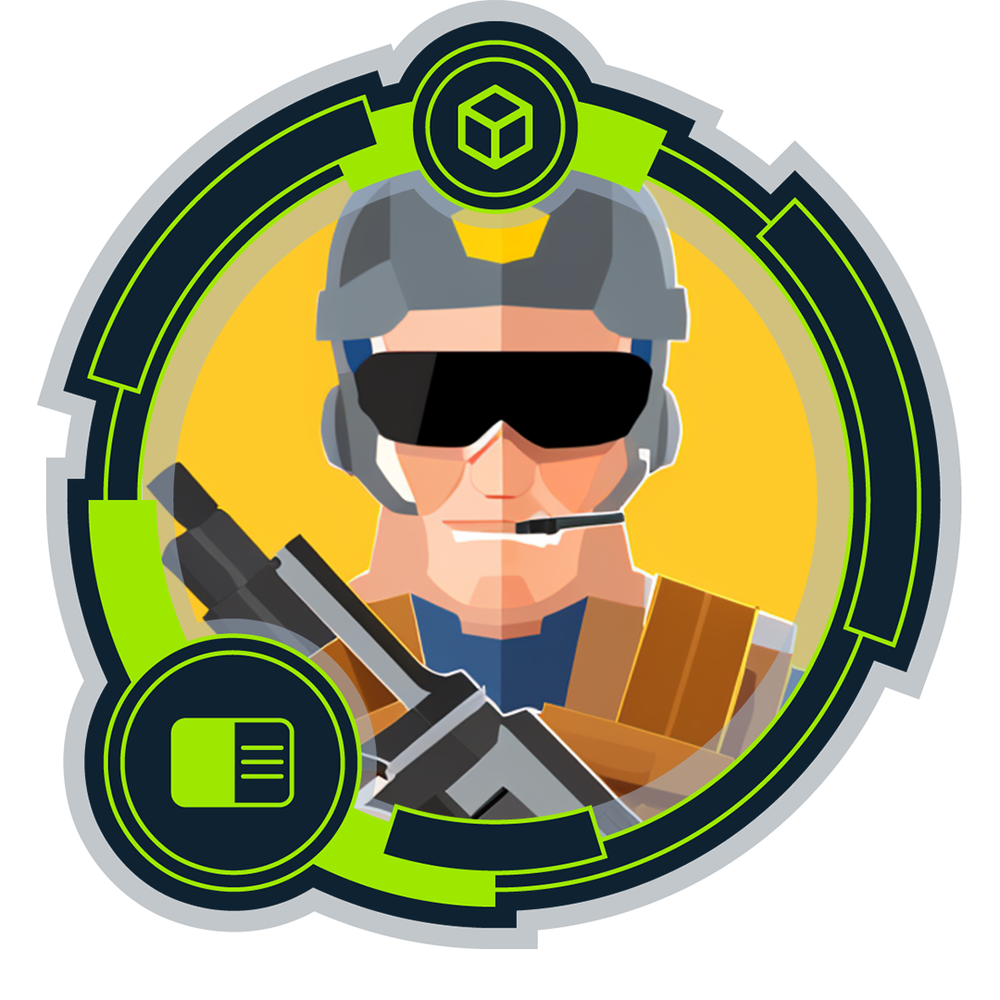</a>
        <p><strong>Tactical Process</strong></p>
        <p>Penetration Testing Process</p>
      </td>
      <td align="center">
        <a>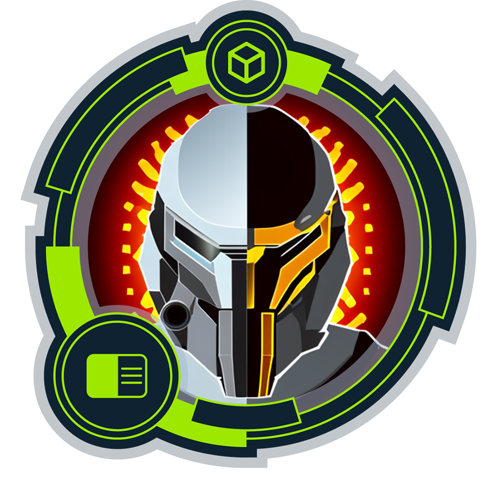</a>
        <p><strong>Trace Before You Hunt</strong></p>
        <p>Footprinting Module</p>
      </td>
    </tr>
    <tr>
      <td align="center">
        <a></a>
        <p><strong>Academician</strong></p>
        <p>Academy Core Fundamentals</p>
      </td>
      <td align="center">
        <a>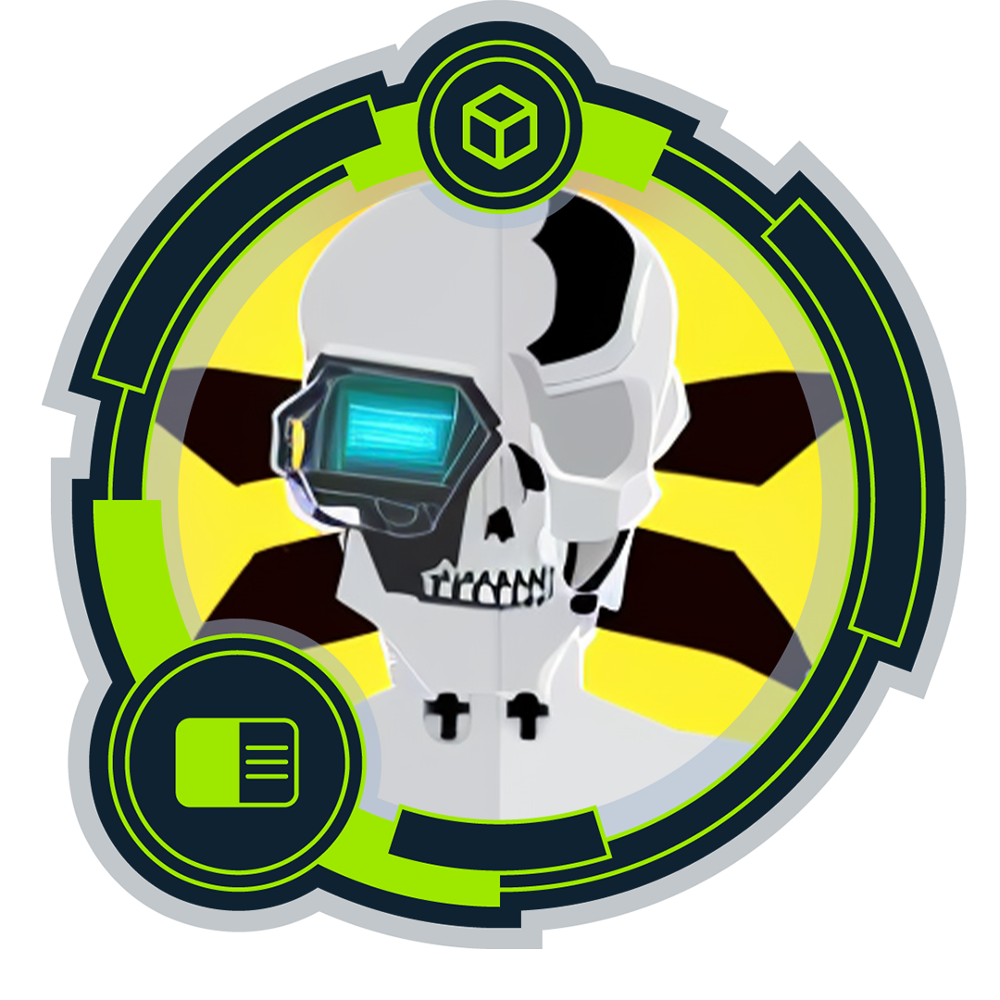</a>
        <p><strong>Scan & Execute</strong></p>
        <p>Attacking Common Services</p>
      </td>
    </tr>
  </table>
</details>

---

## 📜 Ethical Conduct & Write-ups Policy

I am committed to strict ethical hacking standards, responsible disclosure, and authorized engagements:

> **Offensive Security Policy:**
> - 🔒 **Active Challenges:** I never publish solutions, flags, or spoilers for live Hack The Box *Active Machines* or active assessments.
> - 📖 **Retired Content & Methodology:** For retired labs and standalone research, I publish sanitized tradecraft breakdowns, defensive mitigation guides, and tool workflows on my website [h4cker-hub.tech](https://h4cker-hub.tech).
> - 🛡️ **Enterprise Impact:** Every penetration test concludes with actionable mitigation steps, privilege containment guidelines, and architectural fixes to safeguard the client's infrastructure.

---

## 🎯 2026 Mission Directives

- [ ] Earn the **CPTS** (Certified Penetration Testing Specialist) certification.
- [ ] Earn the **CAPE** (Certified Active Directory Pentesting Expert) certification.
- [ ] Earn the **CWES** (Certified Web Exploitation Specialist) certification.
- [ ] Publish deep-dive Active Directory attack graphs & Kerberos exploitation guides on [h4cker-hub.tech](https://h4cker-hub.tech).
- [ ] Maintain a 100% zero-detection stealth benchmark across simulated enterprise lab forests.
- [ ] Release open-source offensive security tooling for automated Active Directory ACL analysis.

<div align="center">
  <br>
  
  <p><em>“The quietest presence leaves the deepest impact.”</em></p>
</div>
